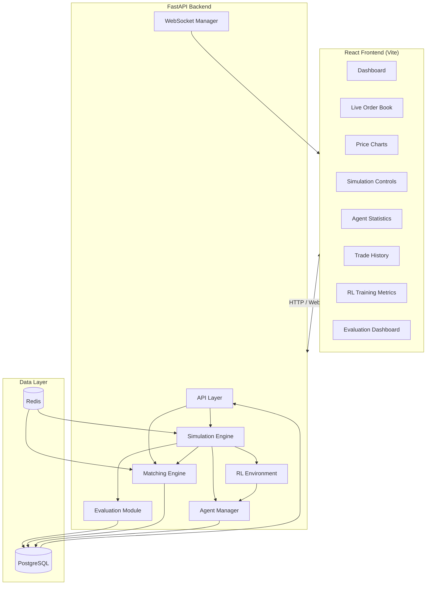
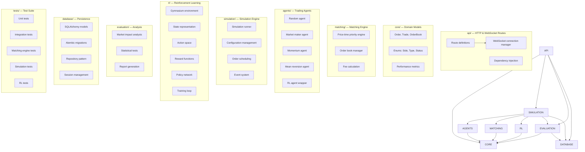
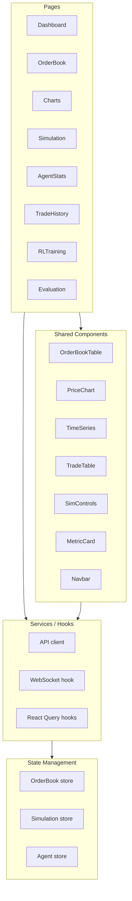
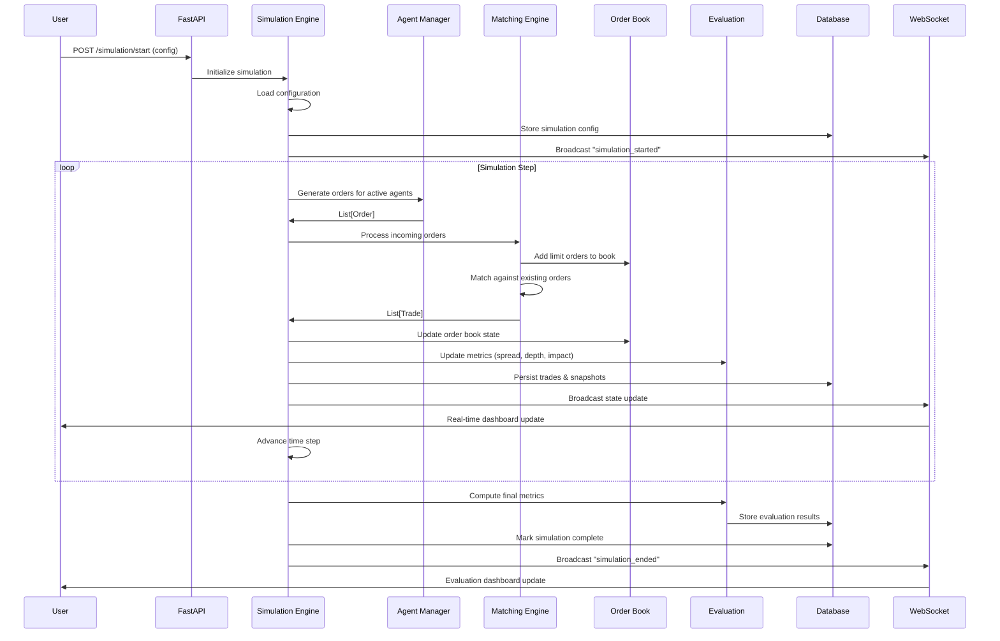
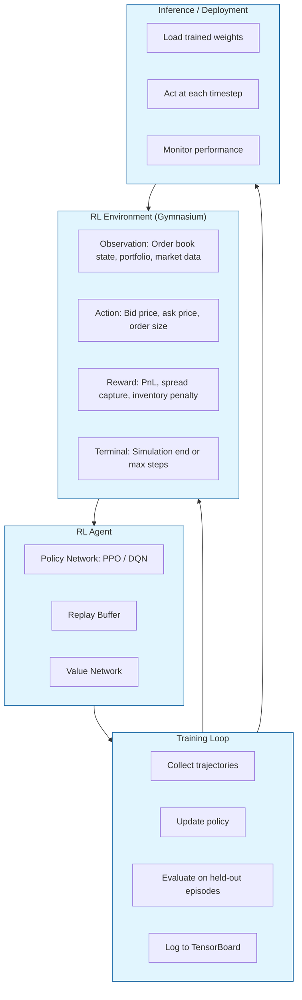

# Milestone 3: System Architecture

## 1. High-Level System Architecture



## 2. Backend Architecture



### Module Responsibilities

| Module | Responsibility |
|--------|---------------|
| `api/` | Expose REST endpoints and WebSocket connections. Handle request validation, serialization, and authentication. |
| `core/` | Define domain models (Order, Trade, OrderBook), enums, and pure business logic with no I/O. |
| `matching/` | Implement price-time priority matching algorithm. Manage order book state. Generate trade events. |
| `agents/` | Implement trading strategies: random, market-making, momentum, mean-reversion, and RL wrapper. |
| `simulation/` | Orchestrate simulation runs. Manage agent lifecycle, order scheduling, event propagation, and time progression. |
| `rl/` | Implement Gymnasium environment for RL training. Define state/action/reward spaces. Training loop and policy networks. |
| `evaluation/` | Compute performance metrics, market impact analysis, Sharpe ratio, etc. Generate reports. |
| `database/` | SQLAlchemy models, Alembic migrations, repository layer for data persistence. |
| `tests/` | Comprehensive test suite covering all modules. |

## 3. Frontend Architecture



### Page & Component Map

| Page | Route | Key Components | Purpose |
|------|-------|---------------|---------|
| Dashboard | `/` | MetricCard, MiniChart, SummaryTable | Real-time system overview |
| Live Order Book | `/orderbook` | OrderBookTable, DepthChart | Visualize bid/ask levels |
| Price Charts | `/charts` | PriceChart, VolumeBars, OHLCChart | Time-series price visualization |
| Simulation Controls | `/simulation` | SimControls, ConfigPanel, LogViewer | Start/stop/configure simulations |
| Agent Statistics | `/agents` | AgentTable, PnLChart, OrderFlow | Per-agent performance metrics |
| Trade History | `/trades` | TradeTable, TradeFlow | Executed trade log |
| RL Training | `/rl` | RewardChart, PolicyView, TrainControls | Monitor RL training progress |
| Evaluation | `/evaluation` | ImpactChart, MetricsGrid, ReportView | Post-simulation analysis |

### Frontend Technology Stack

- **Framework**: React 19 with TypeScript
- **Build Tool**: Vite 8
- **Routing**: React Router v7
- **State Management**: Zustand (lightweight, TypeScript-native)
- **Data Fetching**: TanStack React Query
- **Charts**: Lightweight Charts (TradingView) + Recharts
- **WebSocket**: Custom hook with reconnection logic
- **Styling**: CSS Modules + CSS Variables (dark/light themes)

## 4. Simulation Workflow



## 5. Reinforcement Learning Pipeline



### RL Configuration

| Component | Description |
|-----------|-------------|
| **Environment** | `MarketMicrostructureEnv` implementing Gymnasium `Env` |
| **State** | Order book depth (10 levels), recent trades, inventory, cash, position |
| **Action** | Discrete: price offset from mid (buckets), order size (buckets), side |
| **Reward** | `PnL + spread_capture * w1 - inventory_penalty * w2 - impact_penalty * w3` |
| **Algorithm** | PPO (Proximal Policy Optimization) via Stable-Baselines3 |
| **Training** | Parallel environments, TensorBoard logging, checkpointing |
| **Evaluation** | Held-out market regimes, Sharpe ratio, max drawdown |

## 6. Data Flow

```mermaid
flowchart LR
    AG[("Trading Agents<br/>(Strategy Logic)")]
    OB[("Order Book<br/>(Liquidity Pools)")]
    ME[("Matching Engine<br/>(Order Matching)")]
    TE[("Trade Events<br/>(Executions)")]
    MC[("Metrics Collector<br/>(Aggregators)")]
    DB[("Database<br/>(PostgreSQL)")]
    UI[("Dashboard<br/>(React UI)")]
    RL_ENV[("RL Environment<br/>(Agent Training)")]
    POLICY[("Policy Update<br/>(RL Weights)"])

    AG -->|Submit Orders| OB
    OB -->|Feed Orders| ME
    ME -->|Generate| TE
    TE -->|Update State| OB
    ME -->|Record| MC
    TE -->|Persist| DB
    MC -->|Store Metrics| DB
    MC -->|Broadcast| UI
    DB -->|Historical Data| RL_ENV
    RL_ENV -->|State/Action/Reward| POLICY
    RL_ENV -->|Train/Evaluate| AG
    POLICY -->|Updated Weights| RL_ENV
    DB -->|Query| UI
    OB -.->|Snapshot| UI

    style AG fill:#fff3e0
    style OB fill:#e3f2fd
    style ME fill:#e8f5e9
    style TE fill:#fce4ec
    style MC fill:#f3e5f5
    style DB fill:#ede7f6
    style UI fill:#e0f2f1
    style RL_ENV fill:#fff8e1
    style POLICY fill:#fbe9e7
```

## 7. Project Directory Structure

```
Market_Microstructure _simulator/
├── .gitignore
├── Dockerfile                          # Backend Docker image
├── README.md
│
├── backend/
│   ├── Dockerfile                      # (optional: backend-specific Dockerfile)
│   ├── requirements.txt
│   ├── alembic.ini
│   ├── pyproject.toml
│   ├── app/
│   │   ├── __init__.py
│   │   ├── main.py                     # FastAPI application entry point
│   │   ├── config.py                   # Environment configuration
│   │   └── dependencies.py             # FastAPI dependency injection
│   │
│   ├── api/
│   │   ├── __init__.py
│   │   ├── router.py                   # Main API router
│   │   ├── simulation.py               # Simulation endpoints
│   │   ├── orderbook.py                # Order book data endpoints
│   │   ├── agents.py                   # Agent management endpoints
│   │   ├── evaluation.py               # Evaluation endpoints
│   │   ├── rl.py                       # RL training endpoints
│   │   └── websocket.py                # WebSocket connection manager
│   │
│   ├── core/
│   │   ├── __init__.py
│   │   ├── models.py                   # Order, Trade, OrderBook domain models
│   │   ├── enums.py                    # Shared enumerations
│   │   └── errors.py                   # Custom exception types
│   │
│   ├── matching/
│   │   ├── __init__.py
│   │   ├── engine.py                   # Price-time priority matching engine
│   │   └── types.py                    # Matching-specific types
│   │
│   ├── agents/
│   │   ├── __init__.py
│   │   ├── base.py                     # BaseAgent abstract class
│   │   ├── random_agent.py             # Random order generator
│   │   ├── market_maker.py             # Market making strategy
│   │   ├── momentum.py                 # Momentum strategy
│   │   ├── mean_reversion.py           # Mean reversion strategy
│   │   └── rl_agent.py                 # RL policy wrapper agent
│   │
│   ├── simulation/
│   │   ├── __init__.py
│   │   ├── runner.py                   # Simulation orchestrator
│   │   ├── config.py                   # Simulation configuration models
│   │   ├── scheduler.py                # Order scheduling logic
│   │   └── events.py                   # Event types and bus
│   │
│   ├── rl/
│   │   ├── __init__.py
│   │   ├── environment.py              # Gymnasium environment
│   │   ├── state.py                    # State representation
│   │   ├── actions.py                  # Action space definition
│   │   ├── rewards.py                  # Reward functions
│   │   ├── policy.py                   # Neural network policy
│   │   ├── training.py                 # Training loop
│   │   └── evaluation.py               # RL-specific evaluation
│   │
│   ├── evaluation/
│   │   ├── __init__.py
│   │   ├── metrics.py                  # Performance metric computation
│   │   ├── impact.py                   # Market impact analysis
│   │   ├── statistics.py               # Statistical tests
│   │   └── reporting.py                # Report generation
│   │
│   ├── database/
│   │   ├── __init__.py
│   │   ├── base.py                     # SQLAlchemy Base + engine
│   │   ├── models.py                   # ORM models (simulation, trade, agent)
│   │   ├── repository.py               # Repository pattern
│   │   └── migrations/                 # Alembic migrations
│   │       ├── env.py
│   │       └── versions/
│   │
│   └── tests/
│       ├── __init__.py
│       ├── conftest.py                 # Pytest fixtures
│       ├── test_models.py
│       ├── test_matching_engine.py
│       ├── test_agents.py
│       ├── test_simulation.py
│       ├── test_rl.py
│       ├── test_evaluation.py
│       └── test_api.py
│
├── frontend/
│   ├── Dockerfile
│   ├── nginx.conf
│   ├── package.json
│   ├── tsconfig.json
│   ├── vite.config.ts
│   ├── eslint.config.js
│   ├── index.html
│   │
│   └── src/
│       ├── main.tsx                    # React entry point
│       ├── App.tsx                     # Root component with router
│       ├── App.css
│       ├── index.css                   # Global styles
│       │
│       ├── components/                 # Shared UI components
│       │   ├── Layout/
│       │   │   ├── Navbar.tsx
│       │   │   └── Sidebar.tsx
│       │   ├── OrderBook/
│       │   │   ├── OrderBookTable.tsx
│       │   │   └── DepthChart.tsx
│       │   ├── Charts/
│       │   │   ├── PriceChart.tsx
│       │   │   ├── VolumeChart.tsx
│       │   │   └── OHLCChart.tsx
│       │   ├── Simulation/
│       │   │   ├── SimControls.tsx
│       │   │   └── ConfigPanel.tsx
│       │   ├── Agents/
│       │   │   ├── AgentTable.tsx
│       │   │   └── PnLChart.tsx
│       │   ├── Trades/
│       │   │   └── TradeTable.tsx
│       │   ├── RL/
│       │   │   ├── RewardChart.tsx
│       │   │   └── PolicyViewer.tsx
│       │   ├── Evaluation/
│       │   │   ├── MetricsGrid.tsx
│       │   │   └── ImpactChart.tsx
│       │   └── Common/
│       │       ├── MetricCard.tsx
│       │       ├── Loading.tsx
│       │       └── ErrorBoundary.tsx
│       │
│       ├── pages/                      # Route-level pages
│       │   ├── Dashboard.tsx
│       │   ├── OrderBook.tsx
│       │   ├── Charts.tsx
│       │   ├── Simulation.tsx
│       │   ├── Agents.tsx
│       │   ├── Trades.tsx
│       │   ├── RLTraining.tsx
│       │   └── Evaluation.tsx
│       │
│       ├── services/                   # API & WebSocket
│       │   ├── api.ts                  # Axios/fetch wrapper
│       │   ├── websocket.ts            # WebSocket hook
│       │   └── queries.ts              # React Query hooks
│       │
│       ├── store/                      # Zustand stores
│       │   ├── orderbook.ts
│       │   ├── simulation.ts
│       │   └── agents.ts
│       │
│       ├── hooks/                      # Custom React hooks
│       │   ├── useWebSocket.ts
│       │   └── useSimulation.ts
│       │
│       └── types/                      # TypeScript type definitions
│           ├── orderbook.ts
│           ├── simulation.ts
│           ├── agent.ts
│           ├── trade.ts
│           └── api.ts
│
├── docker/
│   ├── docker-compose.yml              # Multi-service orchestration
│   └── .env.example                    # Environment variable template
│
├── docs/
│   ├── architecture.md                 # [Milestone 3] System architecture
│   ├── api.md                          # API reference
│   └── milestone2_market_microstructure.md
│
├── research/                           # Jupyter notebooks
│   ├── orderbook_analysis.ipynb
│   └── strategy_backtesting.ipynb
│
└── tests/
    └── integration/
        └── test_full_pipeline.py
```

## 8. Design Decisions

### 8.1 FastAPI over Flask/Django

| Criterion | FastAPI | Flask | Django |
|-----------|---------|-------|--------|
| Async support | Native | Limited (3.0+) | Complex |
| WebSocket | Built-in | Extension | Channels |
| Auto-docs | OpenAPI + Swagger | Manual | DRF |
| Performance | Async + Pydantic | Synchronous | Synchronous |
| Type safety | Pydantic | Optional | Serializers |

**Decision**: FastAPI for native async, WebSocket support, and Pydantic validation.

### 8.2 PostgreSQL over SQLite

- **Why**: Concurrent read/write from simulation engine, WebSocket updates, and dashboard queries
- **Alternative considered**: SQLite (single-writer bottleneck, no concurrent access)
- **Scalability**: PostgreSQL supports connection pooling, replication, and time-series extensions
- **Performance**: Proper indexing on orderbook snapshots and trade tables enables sub-millisecond queries

### 8.3 Redis for In-Memory State

- **Why**: Order book state needs sub-millisecond access during simulation
- **Alternative considered**: In-memory Python dicts (lost on restart), pure PostgreSQL (slow for tick-by-tick)
- **Scalability**: Redis can be clustered for large-scale simulations
- **Performance**: Tick-by-tick order book operations in < 1μs

### 8.4 WebSocket for Real-Time Updates

- **Why**: Dashboard needs real-time order book and trade updates during simulation
- **Alternative considered**: Polling (high latency, unnecessary DB load), Server-Sent Events (unidirectional)
- **Scalability**: Horizontal scaling via Redis Pub/Sub
- **Extensibility**: WebSocket supports binary protocols (MessagePack) for high-throughput scenarios

### 8.5 Gymnasium for RL

- **Why**: Industry standard for RL environments, compatible with Stable-Baselines3
- **Alternative considered**: Custom environment (would lose RL library compatibility), Ray RLlib (overkill for initial scope)
- **Scalability**: Gymnasium supports vectorized environments for parallel training
- **Extensibility**: New agents can be added by wrapping any Gymnasium-compatible policy

### 8.6 Zustand for State Management

- **Why**: Minimal boilerplate, TypeScript-native, no providers/filesystem
- **Alternative considered**: Redux Toolkit (too much ceremony for this scale), Jotai (atoms not ideal for aggregate order book state)
- **Performance**: Zustand subscriptions are granular; components re-render only when their slice changes
- **Extensibility**: Middleware support for persistence, devtools, and undo/redo

### 8.7 TradingView Lightweight Charts

- **Why**: Professional-grade financial charts in 40KB gzipped, designed for time-series data
- **Alternative considered**: D3.js (powerful but verbose), Recharts (general-purpose, not finance-optimized)
- **Performance**: Canvas-based rendering handles 10,000+ candles without jank

### 8.8 Repository Pattern for Database

- **Why**: Abstracts data access, makes testing with mock repositories trivial
- **Alternative considered**: Direct SQLAlchemy session usage in routes (tight coupling)
- **Scalability**: Repository pattern allows swapping PostgreSQL for TimescaleDB or ClickHouse without changing business logic

### 8.9 Module Separation (core vs infrastructure)

- **Why**: `core/` contains zero I/O — pure domain logic that can be tested without mocking
- **Alternative considered**: Monolithic approach where models know about database
- **Extensibility**: New matching algorithms, order types, or exchange protocols can be added by implementing interfaces in `matching/` or `core/`

### 8.10 Async Simulation Engine

- **Why**: Simulation requires I/O (database writes, WebSocket broadcasts) between each step; async prevents blocking
- **Alternative considered**: Synchronous with threads (GIL issues), multiprocessing (communication overhead)
- **Performance**: Async event loop handles thousands of orders per second with cooperative multitasking

## 9. Action Items Before Milestone 4

1. **Complete matching engine implementation** (`backend/matching/engine.py`)
   - Implement price-time priority matching with O(log n) book operations
   - Handle market orders, limit orders, partial fills
   - Write comprehensive unit tests

2. **Implement base agent framework** (`backend/agents/base.py`)
   - Abstract `BaseAgent` class with `generate_order()` and `on_trade()` hooks
   - Implement at least 3 strategy agents: random, market maker, momentum

3. **Build simulation runner** (`backend/simulation/runner.py`)
   - Step-based simulation loop with configurable time resolution
   - Event bus for decoupled communication between modules
   - Snapshot mechanism for replay and analysis

4. **Database schema and migrations**
   - Define SQLAlchemy models for simulations, orders, trades, agents
   - Set up Alembic with initial migration
   - Implement repository layer

5. **API endpoints**
   - REST: simulation CRUD, order book snapshots, agent config, evaluation results
   - WebSocket: real-time order book updates, trade feed, simulation status

6. **Frontend pages**
   - Dashboard with summary metrics
   - Order book visualization with depth chart
   - Simulation control panel
   - Basic agent statistics display

7. **RL environment scaffolding**
   - Gymnasium `Env` implementation wrapping the simulation
   - State vector extraction from order book and portfolio
   - Reward function with configurable components

8. **Testing infrastructure**
   - Pytest configuration with coverage reporting
   - Mock database for integration tests
   - CI pipeline (GitHub Actions)

9. **Documentation**
   - API reference (auto-generated from OpenAPI)
   - Setup guide in README
   - Usage examples
