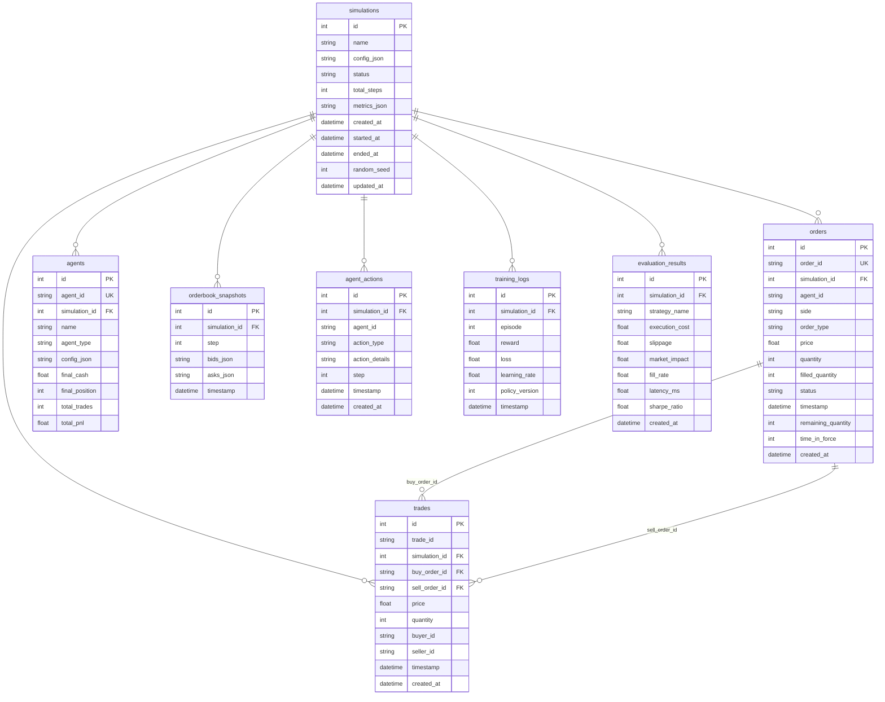

# Milestone 4 — Database Design (Completion Report)

## Summary

Refactored the database layer with proper PostgreSQL-grade schema conventions: foreign key constraints with cascade rules, explicit relationships, missing tables, and Alembic migration support.

## Schema (8 tables)

## Changes Made

### New tables
| Table | Purpose |
|---|---|
| `agent_actions` | Per-step agent actions (action_type, action_details, step) |
| `training_logs` | RL training metrics (episode, reward, loss, lr, policy_version) |
| `evaluation_results` | Strategy evaluation metrics (exec_cost, slippage, fill_rate, sharpe) |

### New columns on existing tables
| Table | Column | Type | Notes |
|---|---|---|---|
| `simulations` | `random_seed` | Integer, nullable | Reproducibility |
| `simulations` | `updated_at` | DateTime, nullable | Auto-updated |
| `orders` | `remaining_quantity` | Integer, NOT NULL | Track unfilled quantity |
| `orders` | `time_in_force` | Integer, nullable | TIF in seconds |
| `orders` | `created_at` | DateTime, NOT NULL | Creation timestamp |
| `trades` | `created_at` | DateTime, NOT NULL | Creation timestamp |

### Foreign key constraints
| Source | Target | Rule | Purpose |
|---|---|---|---|
| all FK tables → `simulations.id` | CASCADE | Delete simulation cascades to all child records |
| `trades.buy_order_id` → `orders.order_id` | SET NULL | Order deletion preserves trade |
| `trades.sell_order_id` → `orders.order_id` | SET NULL | Order deletion preserves trade |

### Other improvements
- Removed duplicate `SimulationStatus` enum (now imports from `core.enums`)
- Fixed `datetime.utcnow()` → `datetime.now(timezone.utc)` throughout
- Moved `DeclarativeBase` to `database/base.py` to prevent circular imports
- Added `relationship()` declarations on `SimulationORM` for all child tables
- Added `render_as_batch=True` in Alembic `env.py` for SQLite compatibility

### New repositories
| Repository | Key methods |
|---|---|
| `AgentActionRepository` | `save`, `save_many`, `get_by_simulation`, `get_by_agent` |
| `TrainingLogRepository` | `save`, `save_many`, `get_by_simulation`, `get_latest_episode` |
| `EvaluationResultRepository` | `save`, `save_many`, `get_by_simulation`, `get_by_strategy` |

## Files Changed

| File | Action |
|---|---|
| `backend/database/base.py` | **NEW** — DeclarativeBase source of truth |
| `backend/database/models.py` | REWRITTEN — 8 ORM models with FK constraints & relationships |
| `backend/database/repository.py` | REWRITTEN — 8 repository classes (3 new) |
| `backend/database/__init__.py` | UPDATED — exports for all models/repos |
| `backend/database/migrations/env.py` | UPDATED — render_as_batch for SQLite |
| `backend/database/migrations/versions/56bcd0e15759_*.py` | **NEW** — Migration adding new tables/columns/FKs |
| `backend/app/dependencies.py` | UPDATED — DI wiring for 3 new repositories |
| `docs/milestone4_database_design.md` | **NEW** — This report |

## Test Results

**34/34 tests pass** (25 original + 9 new repository tests)
